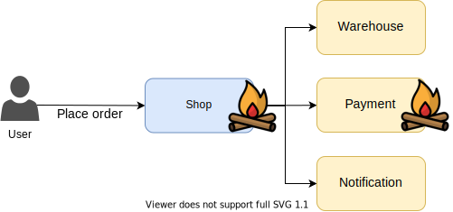
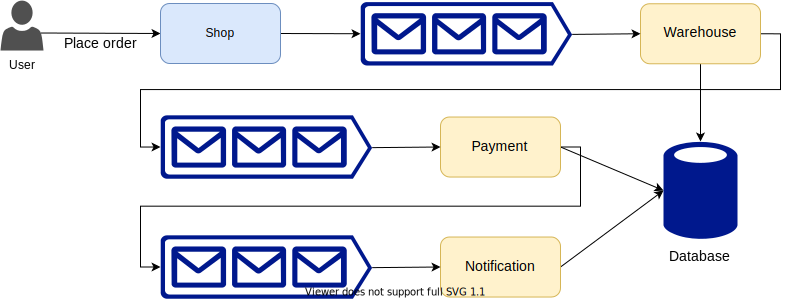

## Intro workshop

---

# Agenda

- History
- About Temporal
- Workshop preparation
- Examples
- Further reading

---

# History

--

## Problem

Long running, complex interactions...

...in distributed systems. <!-- .element: class="fragment" data-fragment-index="1" -->

--

## Example


--

## Naive implementation

```go
func placeOrder(o Order) {
    warehouse.ReserveItems(o.Items)

    payment.ProcessPayment(o)

    notifyBuyer(o, OrderPlaced)

    saveOrder(o)
}
```

--

## Failure



--

## Failure modes

```go
func placeOrder(o Order) {
    reserved, err := warehouse.ReserveItems(o.Items)
    if err != nil { // Warehouse service unavailable
        // Retry?
    }

    if !reserved { // Business error requiring user intervention
        notifySeller(o, OrderFailed)
        notifyBuyer(o, OrderFailed)

        return
    }

    // ...
}
```

--

## Queues FTW


--

## Status?

- User: what's going on with my order?
- Seller: incoming orders?

--

## State!



--

## Reinventing wheels


*Source: [StackOverflow Blog](https://stackoverflow.blog/2020/11/23/the-macro-problem-with-microservices/)* <!-- .element style="font-size: 13px" -->
<!-- .element style="margin-top: -30px;" -->

--

## Lessons learnt

- No *one size fits all* solution (yet)
- Fragile systems
- Distributed transactions? (2PC, Saga)
- Lack of orchestration

--

## Lack of orchestration

- Fractured business processes
- Changes affect a lot of components
- Cancellations?
- Compensating actions?
- Additional interactions?
- Troubleshooting?

--

## We want this

```go
func placeOrder(o Order) {
    warehouse.ReserveItems(o.Items)

    payment.ProcessPayment(o)

    notifyBuyer(o, OrderPlaced)

    saveOrder(o)
}
```

---

# About Temporal

--

## What is Temporal?

- Temporal service
- Temporal SDK *(insert your programming language here)*

--

## Orchestration as code

- Write business logic as plain code
- Orchestration framework
- Durability and fault-tolerance out-of-the-box

--


*Source: [Temporal docs](https://docs.temporal.io/docs/server-architecture#overview)* <!-- .element style="font-size: 13px" -->
<!-- .element style="margin-top: -30px;" -->

--

## Workflows

- Encapsulates business logic
- Durable function
- Only deterministic code allowed:
    - Plain code
    - Deterministic wrappers
    - Activities

**[Documentation](https://docs.temporal.io/docs/concepts/workflows)**

--

## Deterministic wrappers

- Timers
- Async wrappers
- Side effect

--

## Activities

- Custom, non-deterministic code (eg. API calls)
- Building blocks for workflows
- Asynchronously executed

**[Documentation](https://docs.temporal.io/docs/concepts/activities)**

--

## Workers

- Executes workflows and activities
- Listens to task queues

**[Documentation](https://docs.temporal.io/docs/concepts/workers)**

--


--

## Other notable concepts

- [**Namespace**](https://docs.temporal.io/docs/server/namespaces): unit of isolation and replication domain (analogous to a database)
- [**Task queue**](https://docs.temporal.io/docs/concepts/task-queues): routing mechanism to different kinds of workers

---

# Workshop preparation

--

## Prepare your environment

1. Git, Make, etc.
2. Make sure you have the latest [Go](https://golang.org/) and [Docker](https://www.docker.com/get-started) installed

--

## Setup the project

Checkout the following repository:
[`https://github.com/sagikazarmark/temporal-intro-workshop`](https://github.com/sagikazarmark/temporal-intro-workshop)

Follow the instructions in the readme.

--

## Check the tools

- UI: http://127.0.0.1:8088
- CLI: `make shell`

---

# Workflows

--

- Single unit of orchestration logic
- Write business logic as simple code
- **MUST** be deterministic
- Parameters **MUST** be serializable

--

## Reminder

```go
func placeOrder(o Order) {
    warehouse.ReserveItems(o.Items)

    payment.ProcessPayment(o)

    notifyBuyer(o, OrderPlaced)

    saveOrder(o)
}
```

--

## Example 1

--

## Example 2

- Input: number (integer)
- Output: factorial of the number

--

## Example 3

--

## Example 4

Write a test for Example 2.

--

## Determinism

> Output value is based entirely on the input.

```go
func add(a, b int) int {
    return a + b
}
```

```go
func add(a, b int) int {
    // This is not deterministic
    resp := http.Get(fmt.Sprintf("https://add.com/%d/%d", a, b))

    return decodeBody(resp.Body)
}
```

--

## Forbidden in Go

- Time functions `time.Now`, `time.Sleep`
- Goroutines
- Channels and selects
- Iterating over maps

Use [deterministic wrappers](https://docs.temporal.io/docs/go/workflows#how-to-write-workflow-code) instead.

--

## Forbidden in general

- Accessing external systems (usually over network)

--

## Example 5 & 6

--

## Workflow replay

1. Workflow is scheduled to run on a worker
1. Workflow returns with a list of **commands**
1. Temporal records the commands in the history in the form of **events** (eg. `StartTimer` -> `TimerStarted`)
1. Workflow gets scheduled again
1. Worker _replays_ the history by calling the workflow function
1. Workflow returns with a list of commands
1. ...
1. Workflow ends

--

## Workflow replay

```go
func Workflow(ctx workflow.Context, input Input) (Output, error) {
    encodedNumber := workflow.SideEffect(ctx, func(ctx workflow.Context) interface{} {
        return rand.Intn(max)
    })

    sum := input.Number + number

    workflow.Sleep(ctx, 1*time.Second)

    return Output{sum}, nil
}

```

--

## Example 7

Write a query handler (for your workflow from examples 2, 4) that returns the current result in the loop.

Add sleep at the beginning of the loop so you have time to query it using the CLI.

--

## Recap

- Workflows implement business logic
- Compared to queue based solutions they provide orchestration
- They **MUST** be deterministic

--

## Undiscussed topics

- Child workflows
- Versioning
- Reset / Cancellation
- Search attributes
- Sessions
- Cron
- ...

https://docs.temporal.io/docs/concepts/workflows

https://docs.temporal.io/docs/go/introduction


---

# Activities

--

- Single task within a workflow
- Can be non-deterministic
- API calls, database access, etc
- Just regular code with regular tests

--

## Example 8 & 9

--

## Example 10

Rewrite the factorial calculation (based on examples 2, 4, 7) as an activity (with retries and timeouts):

- It should always fail on the first attempt
- Rewrite the tests so they continue to pass

--

## Undiscussed topics

- Cancellation
- Async completion
- Local activities

https://docs.temporal.io/docs/concepts/activities

https://docs.temporal.io/docs/go/introduction

---

# Further reading

--

https://stackoverflow.blog/2020/11/23/the-macro-problem-with-microservices/

--

https://docs.temporal.io/docs/concepts/introduction

https://docs.temporal.io/docs/reference/glossary

--

https://docs.temporal.io/application-development

--

https://docs.temporal.io/docs/samples-library

--

https://docs.temporal.io/blog/tags/go-ecommerce-tutorial/

---

# The End
