## Intro workshop

---

# Agenda

- History
- Temporal
- Workshop

---

# History

--

## Problem

Long running, complex interactions... <!-- .element: class="fragment" -->

...in distributed systems... <!-- .element: class="fragment" -->

...with transactional characteristics. <!-- .element: class="fragment" -->

--

## Example

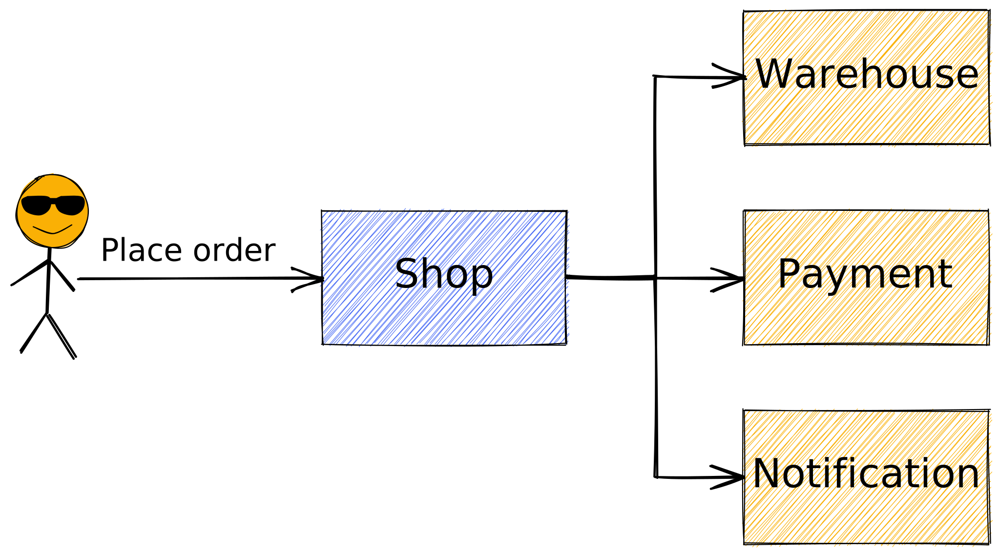

--

## Naive implementation

```go
func placeOrder(o Order) {
    warehouse.ReserveItems(o.Items)

    payment.ProcessPayment(o)

    notifyBuyer(o, OrderPlaced)

    saveOrder(o)
}
```

--

## Failure

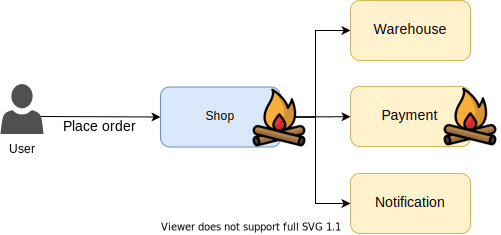

--

## Failure modes

```go
func placeOrder(o Order) {
    reserved, err := warehouse.ReserveItems(o.Items)
    if err != nil { // Warehouse service unavailable
        // Retry?
    }

    if !reserved { // Business error requiring user intervention
        notifySeller(o, OrderFailed)
        notifyBuyer(o, OrderFailed)

        return
    }

    // ...
}
```

--

## Queues FTW

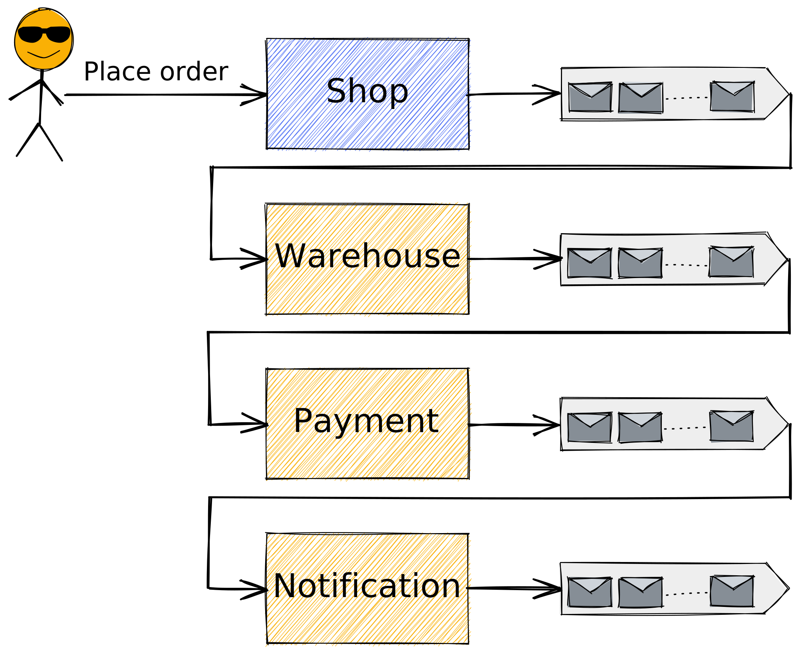

--

## Event choreography

| **Service**                                      | **Input**                                                                                                | **Output**                                                                                 |
|--------------------------------------------------|----------------------------------------------------------------------------------------------------------|--------------------------------------------------------------------------------------------|
| Shop <!-- .element: class="fragment" -->         | <span>`PlaceOrder`<sup>\*</sup></span> <!-- .element: class="fragment" -->                                | `OrderPlaced` <!-- .element: class="fragment" -->                                          |
| Warehouse <!-- .element: class="fragment" -->    | `OrderPlaced` <!-- .element: class="fragment" -->                                                        | <span>`ItemsReserved` / `ItemReservationFailed`</span> <!-- .element: class="fragment" --> |
| Payment <!-- .element: class="fragment" -->      | `ItemsReserved` <!-- .element: class="fragment" -->                                                      | <span>`OrderPaid` / `PaymentFailed`</span> <!-- .element: class="fragment" -->             |
| Notification <!-- .element: class="fragment" --> | <span>`OrderPaid` / `PaymentFailed` / `ItemReservationFailed`</span> <!-- .element: class="fragment" --> | `BuyerNotified` <!-- .element: class="fragment" -->                                        |
<!-- .element: class="valign-middle" -->

--

## Faliure with queues

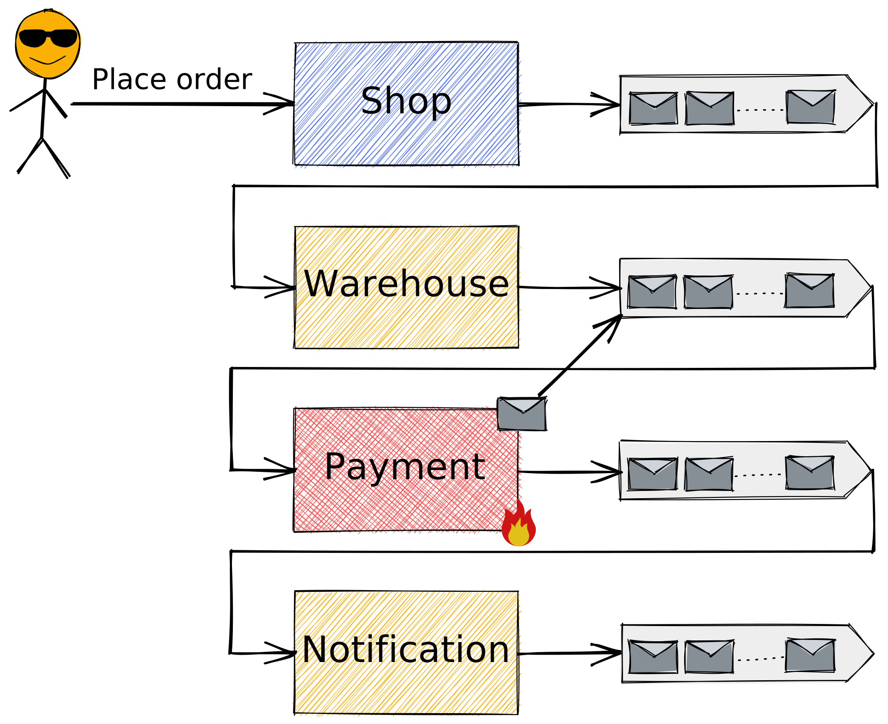

--

## Status?

- **User:** what's going on with my order?
- **Seller:** incoming orders?
- **Developer:** debug a single execution?

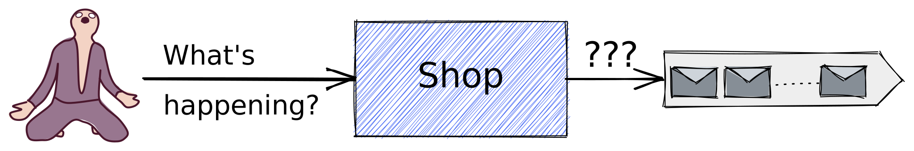

--

## Cancellation?

- **User:** I changed my mind, give me my money back!
- **Payment failed:** User failed to pay the order, cancel it!

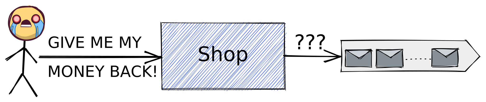

--

## State!

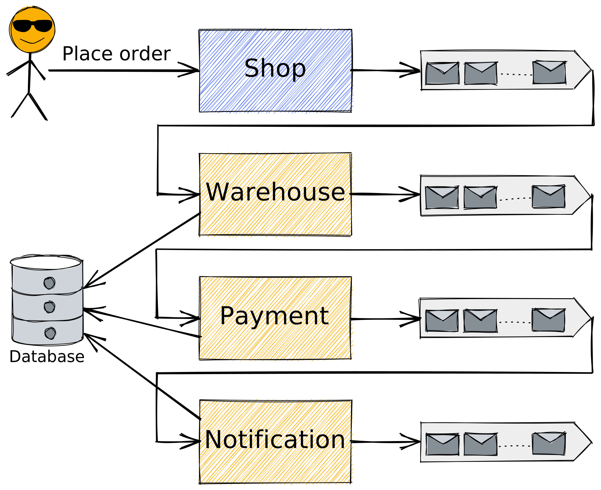

--

## Reinventing wheels

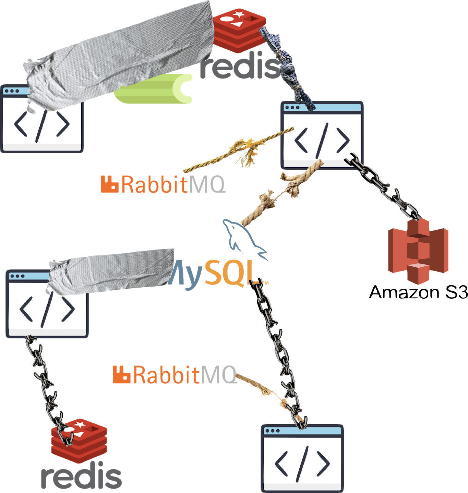

*Source: [StackOverflow Blog](https://stackoverflow.blog/2020/11/23/the-macro-problem-with-microservices/)* <!-- .element style="font-size: 13px" -->
<!-- .element style="margin-top: -30px;" -->

--

## Lessons learnt

- No *one size fits all* solution (yet)
- Fragile systems
- Lack of orchestration

--

## Lack of orchestration

- Fractured business processes
- Tight coupling between components
- Cancellations?
- Compensating actions?
- Additional interactions?
- Troubleshooting?

--

## We want this

```go
func placeOrder(o Order) {
    warehouse.ReserveItems(o.Items)

    payment.ProcessPayment(o)

    notifyBuyer(o, OrderPlaced)

    saveOrder(o)
}
```

---

# Temporal

--

## What is Temporal?

- Temporal service
- Temporal SDK *(insert your programming language here)*

--

## Orchestration as code

- Write business logic as plain code
- Orchestration framework
- Durability and reliability out-of-the-box

--

## Concepts

- Workflow
- Activity
- Worker

_[Documentation](https://docs.temporal.io/concepts)_

--

## Workflow

- Definition
- Type
- Execution

_[Documentation](https://docs.temporal.io/workflows)_

--

## Workflow Definition

- aka. _Workflow Function_
- Encapsulates business logic
- Required to be **deterministic**
- Implemented in the _Worker_

_[Documentation](https://docs.temporal.io/workflows#workflow-definition)_

--

## Determinism

> Output is based entirely on the input.

```go
func add(a, b int) int {
    return a + b
}
```

```go
func add(a, b int) int {
    // This is not deterministic
    resp := http.Get(fmt.Sprintf("https://add.com/%d/%d", a, b))

    return decodeBody(resp.Body)
}
```

--

## Workflow Type

Identifies a _Workflow Definition_ (in the scope of a _Task Queue_)

_[Documentation](https://docs.temporal.io/workflows#workflow-type)_

--

## Workflow Execution

- Durable and reliable execution of a _Workflow Definition_
- Runs once to completion
- Executed by the _Worker_

_[Documentation](https://docs.temporal.io/workflows#workflow-execution)_

--

## Activity

- Definition
- Type
- Execution

_[Documentation](https://docs.temporal.io/activities)_

--

## Activity Definition

- aka. _Activity Function_
- Building blocks for _Workflow( Definition)s_
- No restrictions on the code (ie. can be non-deterministic)
- Asynchronously executed
- Generally **idempotent**

_[Documentation](https://docs.temporal.io/activities#activity-definition)_

--

## Idempotence

> Applying an operation multiple times does not change the result beyond the initial application.

--

## Activity Type

Identifies an _Activity Definition_ (in the scope of a _Task Queue_)

_[Documentation](https://docs.temporal.io/activities#activity-type)_

--

## Activity Execution

- Execution of an _Activity Definition_
- Can timeout
- Can be retried
- At least once execution guarantee
- Runs to completion or exhausts timeouts/retries
- Executed by the _Worker_

_[Documentation](https://docs.temporal.io/activities#activity-execution)_

--


--

## Example

```go
// workflow type: "placeOrder"
func placeOrder(o Order) {
    for _, item := range o.Items {
        err := temporal.ExecuteActivity("warehouse.ReserveItem", item)
        // handle error
    }

    // ...
}

// activity type: "warehouse.ReserveItem"
func reserveItem(item OrderItem) error {
    if !items.IsAvailable(item.Quantity) { return ErrItemNotAvailable }

    // ..

    return nil
}
```
--

## Worker

- Implemented and operated by the user
- Executes _Workflows_ and _Activities_
- Listens to _Task Queues_

_[Documentation](https://docs.temporal.io/workers)_

--

<!-- .slide: data-visibility="hidden" -->

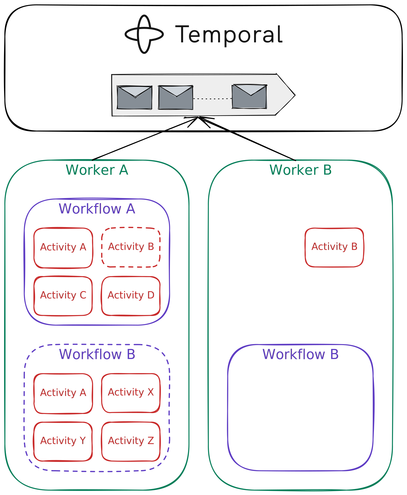

--

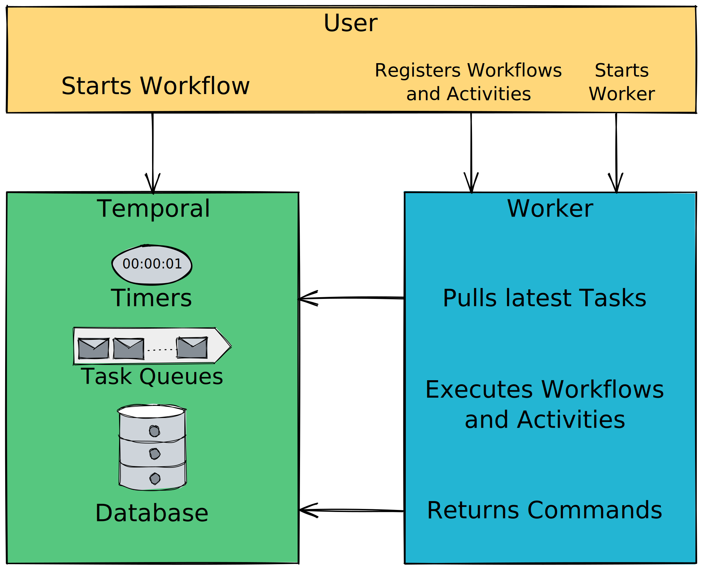

--

## Other notable concepts

- [**Namespace**](https://docs.temporal.io/namespaces): unit of isolation and replication domain (analogous to a database)
- [**Task Queue**](https://docs.temporal.io/tasks#task-queue): routing mechanism to different kinds of _Workers_

---

# Preparation

--

## Prepare your environment

1. Git, Make, etc.
2. Make sure you have the latest [Go](https://golang.org/) and [Docker](https://www.docker.com/get-started) installed

--

## Setup the project

Checkout the following repository:

[`https://github.com/sagikazarmark/temporal-intro-workshop`](https://github.com/sagikazarmark/temporal-intro-workshop)

Follow the instructions in the README.

--

## Check the tools

- UI: http://127.0.0.1:8080
- CLI: `make shell`

---

# Workflows

--

- Write business logic as code
- **MUST** be deterministic
- Parameters **MUST** be serializable

--

## Reminder

```go
func placeOrder(o Order) {
    warehouse.ReserveItems(o.Items)

    payment.ProcessPayment(o)

    notifyBuyer(o, OrderPlaced)

    saveOrder(o)
}
```

--

## Example 1

Simple workflow function.

--

## Example 2

- Input: number (integer)
- Output: factorial of the number

--

## Example 3

Writing unit tests for a workflow.

--

## Example 4

Write a test for [Example 2](#/5/4).

--

## Determinism

> Output value is based entirely on the input.

```go
func add(a, b int) int {
    return a + b
}
```

```go
func add(a, b int) int {
    // This is not deterministic
    resp := http.Get(fmt.Sprintf("https://add.com/%d/%d", a, b))

    return decodeBody(resp.Body)
}
```

--

## Forbidden in Go

- Time functions `time.Now`, `time.Sleep`
- Goroutines
- Channels and selects
- Iterating over maps

Use [deterministic wrappers](https://docs.temporal.io/application-development/foundations#workflow-logic-requirements) instead.

--

## Forbidden in general

- Accessing external systems (usually over network)
- Accessing the filesystem
- Generating random values

--

## Example 5

Side-effects in a workflow.

--

## Example 6

Communicating with a running workflow.

--

## Example 7

Write a query handler (for your workflow from examples 2, 4) that returns the current result in the loop.

**Tip:** Add sleep at the beginning of the loop so you have time to query it using the CLI.

--

## Log-based execution

- Record a history of events
- _Replay_ events to get to the current state

--

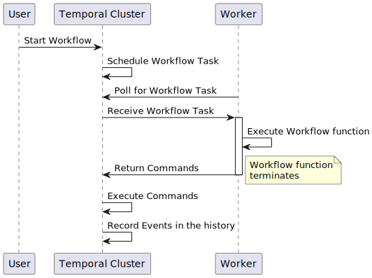

--

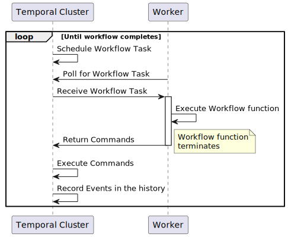

--

## Workflow replay

```go [|2|4|6]
func Workflow(ctx workflow.Context) error {
    foo := workflow.ExecuteActivity(ctx, "foo")

    workflow.Sleep(ctx, 10 * time.Second)

    workflow.ExecuteActivity(ctx, "bar", foo)
}

```

--

## Recap

- Workflows implement business logic
- They **MUST** be deterministic (due to log-based execution)

--

## Undiscussed topics

- Child workflows
- Versioning
- Reset / Cancellation
- Search attributes
- Sessions
- Cron
- ...

_[Documentation: Workflows](https://docs.temporal.io/workflows)_

_[Documentation: Workflow development in Go](https://docs.temporal.io/go/develop-workflows)_

---

# Activities

--

- Single task within a workflow
- Can be non-deterministic
- API calls, database access, etc
- Just regular code with regular tests

--

## Example 8

Simple activity function.

--

## Example 9

Activity retry.

--

## Example 10

Rewrite the factorial calculation (based on examples 2, 4, 7) as an activity (with retries and timeouts):

- It should always fail on the first attempt
- Rewrite the tests so they continue to pass

--

## Undiscussed topics

- Cancellation
- Async completion
- Local activities

_[Documentation: Activities](https://docs.temporal.io/activities)_

_[Documentation: Activity development in Go](https://docs.temporal.io/go/develop-activities)_

---

# Further reading

--

https://stackoverflow.blog/2020/11/23/the-macro-problem-with-microservices/

--

[Documentation: Concepts](https://docs.temporal.io/concepts)

[Documentation: Glossary](https://docs.temporal.io/glossary)

--

[Documentation: Developer's guide](https://docs.temporal.io/application-development/)

--

[Temporal learning materials](https://learn.temporal.io/)

---

# The End
